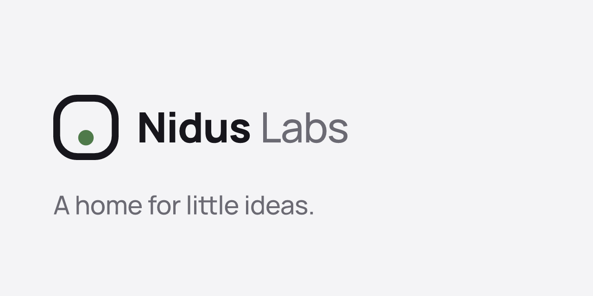

# Nidus Labs assets

The studio's logo, icons and social images. *Nidus* is Latin for "nest": the mark is an app tile with a seed settling into it.

**A home for little ideas.**



## What's here

| Folder | Files | Use |
| --- | --- | --- |
| `logo/` | `mark`, `lockup` (mark + wordmark), each `on-dark`, `mono-black`, `mono-white` (SVG); PNGs in `logo/png/` | Anywhere the logo appears. Prefer the SVG. |
| `avatar/` | `avatar.svg`, `avatar-1024.png`, `avatar-512.png` | GitHub, npm, and other profile pictures. Safe for a circle crop. |
| `web/` | `favicon.svg`, `favicon.ico` (16, 32, 48), `apple-touch-icon.png`, `icon-192.png`, `icon-512.png`, `icon-maskable-512.png` | Websites and web app manifests. |
| `social/` | `og-image.png` (1200×630), `github-social-preview.png` (1280×640) | Link previews and the GitHub social preview. |
| `stores/` | `google-play-header.png` (4096×2304), `google-play-icon-512.png` | The Google Play developer page. 24-bit PNGs, since Play refuses transparency. |
| `apps/splito/` | `google-play-icon-512.png`, `google-play-feature-graphic.png` (1024×500) | Splito's store listing: its icon redrawn from the app's shapes, and its name in Plus Jakarta Sans, the app's typeface. |
| `tokens.json` | Colours, byline, wordmark type | The single source for the values below. |

## Colours

| Token | Hex | Use |
| --- | --- | --- |
| `ink` | `#17161C` | The tile, text, dark grounds |
| `paper` | `#F4F4F6` | Light grounds; the tile on dark |
| `moss` | `#4F7A4A` | The seed, on light |
| `mossOnDark` | `#8DBB82` | The seed, on dark |
| `muted` | `#6B6A73` | "Labs" and secondary text, on light |
| `mutedOnDark` | `#B9B8C2` | The same, on dark |

The mark is ink first so it sits beside any app's own colours. Moss is used only for the seed.

## Wordmark

Manrope: **Nidus** in ExtraBold (800), Labs in Medium (500), tracking −0.02em. The SVGs have the text outlined, so they need no font installed.

## Using the mark

- Keep clear space around it of at least the seed's diameter.
- Use the regular mark from 48 px up. Below that, use `web/favicon.svg` or `favicon.ico`: a heavier cut drawn for small sizes.
- On photos or colour, use a mono version.
- Don't recolour the seed to anything but moss (or the mono colour), stretch the tile, or set the wordmark in another typeface.

## Rebuilding

Everything is generated from `scripts/build.mjs` and `tokens.json`; change those, never the outputs by hand.

```sh
npm install
npm run build
```

The build outlines text from the Manrope and Plus Jakarta Sans files in `scripts/fonts/` (both SIL Open Font License; see the `OFL-*.txt` files there) and renders the PNGs with resvg.
